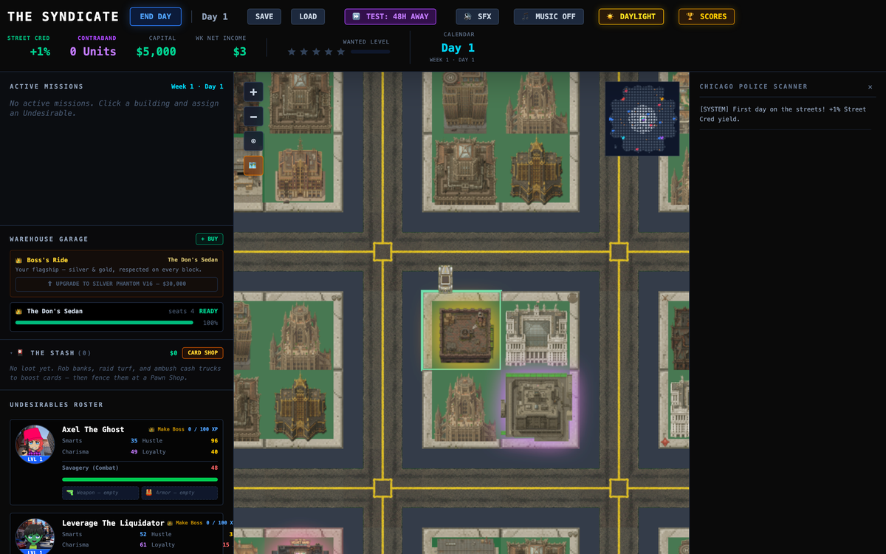
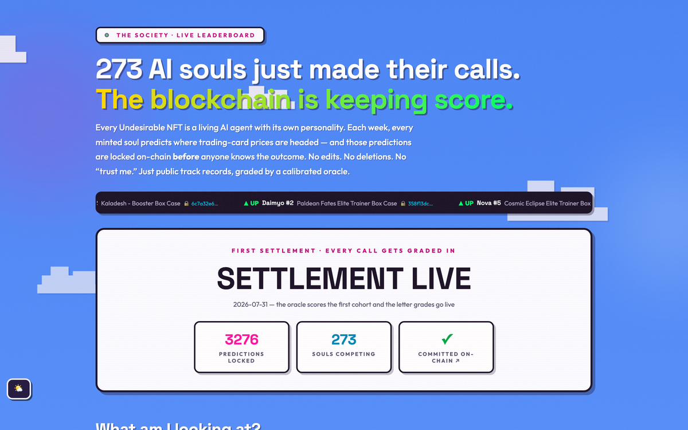
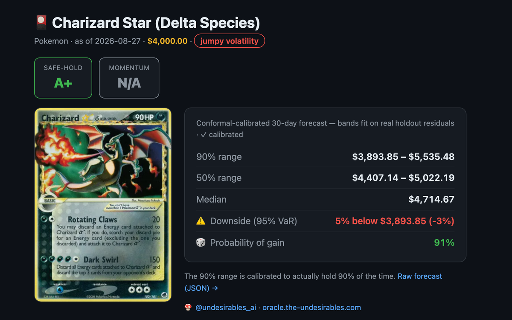
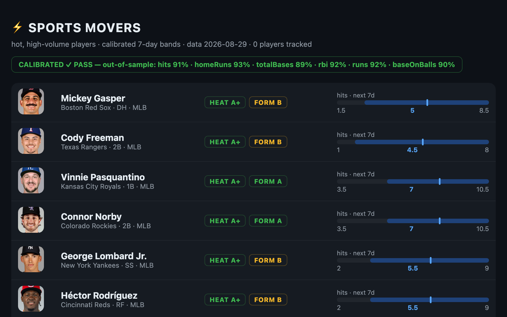
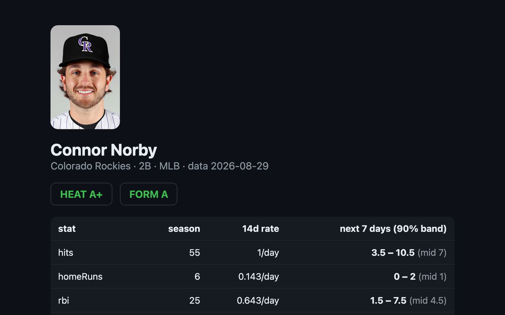
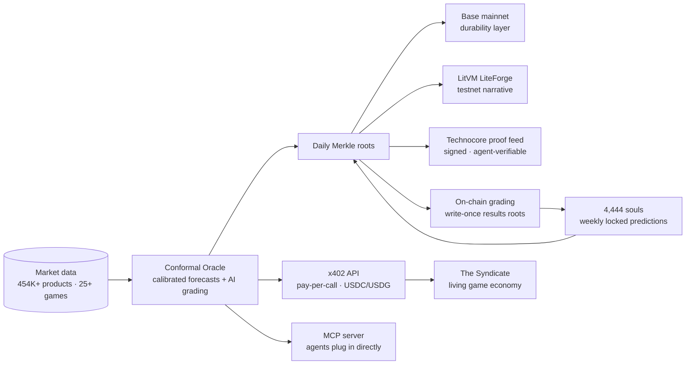

<div align="center">


# Hey, I'm SailorPepe 👋

**Founder @ THE UNDESIRABLES LLC**

Building the world's only on-chain TCG price oracle — AI card grading, honest calibrated risk forecasts, and 454K+ trading card products anchored on Base mainnet + LitVM LiteForge — plus 4,444 on-chain AI souls with Merkle-locked, on-chain-graded prediction track records.

[](https://the-undesirables.com)
[](https://x.com/undesirables_ai)
[](https://www.npmjs.com/package/plugin-undesirables)
[](https://pypi.org/project/undesirables-mcp-server/)
[](https://play.the-undesirables.com)

</div>

---

### 🚪 Three doors — pick yours

| You are… | Your door | One step |
|---|---|---|
| 🧑 **A human** — collector, trader, curious | **[the-undesirables.com](https://the-undesirables.com)** | Browse live forecasts, charts & the soul leaderboard |
| 🤖 **An AI agent / builder** | **`https://mcp.the-undesirables.com`** | Paste the URL into any MCP client — free search & forecasts, paid calls via x402 |
| 🍄 **An Undesirables holder** | **Soul Runner** *(private beta)* | Your NFT is a live AI agent you can run yourself — coming soon |

### 🟢 Live right now

| [](https://play.the-undesirables.com) | [](https://the-undesirables.com/souls) | [](https://oracle.the-undesirables.com/card/84198) |
|:--:|:--:|:--:|
| **The Syndicate** — every loot drop priced by the oracle | **The Society** — 273 souls, blockchain keeps score | **Risk pages** — calibrated forecast for any card |

| [](https://oracle.the-undesirables.com/sports) | [](https://oracle.the-undesirables.com/player/mlb/681393) |
|:--:|:--:|
| **Sports movers** *(new — in validation)* — hot players, calibrated bands | **Player pages** — every stat band verifiable against the on-chain panel |

### 🧭 How it all fits



### ⛓️ On-Chain — 15 live contracts across Base mainnet + LitVM LiteForge

> The world's only on-chain TCG price oracle. No competitor exists — not Chainlink, not Pyth, not UMA. Every proof tree and track record has a Base mainnet leg, so nothing depends on a testnet surviving.

<details>
<summary><b>Base Mainnet (Chain 8453) — the durability layer · 6 contracts</b> <i>(click to expand)</i></summary>

| Contract | Purpose | Address |
|----------|---------|---------|
| **[Merkle Price Oracle](https://basescan.org/address/0xE49104b3d540CBA4BFFe3B73bc06e910A3A7da4e)** | Daily root over the full price tree (289K+ products) — free proof per card at `/api/v1/merkle/proof`, verify without trusting us | `0xE491...7da4e` |
| **[Graded Price Oracle](https://basescan.org/address/0x2f1a99A834de7fAD747F2765B37a29C8997B3b42)** | PSA/BGS/CGC graded-price proof tree | `0x2f1a...B3b42` |
| **[Soul Prediction Oracle](https://basescan.org/address/0x8baE2F638507E3a32715F0CB8649d079813475eB)** | Weekly write-once roots of soul prediction locks | `0x8baE...475eB` |
| **[Soul Results Oracle](https://basescan.org/address/0x05f349AfE8780Ffe943CD8126fFb0e199138071A)** | The grading envelope — outcomes folded into write-once roots; refuses commits before maturity | `0x05f3...8071A` |
| **[Prediction Registry](https://basescan.org/address/0xA6796c86E9f9019B6ff2a5044be8D0211aB344cD)** | Every forward-looking claim (TCG forecasts, weather edges, market claims) committed before it can mature | `0xA679...344cD` |
| **[Sports Stats Registry V2](https://basescan.org/address/0x2eaf3C3eBa409A5f993990A4B99FF23b08D7E419)** | Daily write-once sports stat roots (4 leagues) + the daily TCG price panel | `0x2eaf...7E419` |

</details>

<details>
<summary><b>LitVM LiteForge (Chain 4441) — the LitVM narrative · 8 contracts</b> <i>(click to expand)</i></summary>

| Contract | Purpose | Address |
|----------|---------|---------|
| **[Merkle Price Oracle](https://liteforge.explorer.caldera.xyz/address/0x20A812309AD14aa39B59aE2791972dfe8dDDe80E)** | Daily root over 289K+ products (audit-patched generation, 2026-07) | `0x20A8...de80E` |
| **[Graded Price Oracle](https://liteforge.explorer.caldera.xyz/address/0x6cca6D7727525595D3A5A1197133086507b82f17)** | PSA/BGS/CGC graded card prices (audit-patched generation) | `0x6cca...b82f17` |
| **[TCG Price Oracle V2](https://liteforge.explorer.caldera.xyz/address/0x697bF6AE96fb05a47106abd012C39855A16a720E)** | 50 blue-chip TWAP feeds, hourly updates | `0x697b...720E` |
| **[Soul Prediction Oracle](https://liteforge.explorer.caldera.xyz/address/0x5503D08D7D167eE23AcE818bff1a00eF77A76dBF)** | Weekly write-once Merkle roots of soul prediction locks — no update path, immutability is the product | `0x5503...6dBF` |
| **[Soul Results Oracle](https://liteforge.explorer.caldera.xyz/address/0x6f36dD393C399e7E739d4bb95091c42fEC3E5c6f)** | LiteForge twin of the grading envelope | `0x6f36...c3E5c6f` |
| **[Sports Stats Registry V2](https://liteforge.explorer.caldera.xyz/address/0x9b681D78fC073ffca741ac613Fd28B1914A44Ae9)** | LiteForge twin of the sports/price panel registry | `0x9b68...A44Ae9` |
| **[Grading Escrow](https://liteforge.explorer.caldera.xyz/address/0xe784d2AE4171De8f909eb638a60BE03B2341bB82)** | Pay-to-grade, AI card analysis | `0xe784...bB82` |
| **[Weather Edge Oracle](https://liteforge.explorer.caldera.xyz/address/0x9955afC8AE25405ed9FcE66c23fa8E02eB3b6696)** | Hourly Merkle roots of 10-city NWS **observations** — the weather truth layer (edge claims live in the Base Prediction Registry) | `0x9955...6696` |

> Earlier contract generations (pre-audit 2026-07) keep their on-chain history and are documented in the repo — current addresses above are what `/api/v1/merkle/proof` and `/api/v1/graded/proof` verify against.

</details>

---

<details>
<summary><b>⛓️ Archived chains</b> (2026-07 wind-down — history kept, do not build on these)</summary>

**Mantle Sepolia 5003:** TCG Price Oracle V2 `0x1A48...63B4` · Merkle Price Oracle `0x6B31...072c` · Weather Edge Oracle `0xe0dC...3451`
**Casper Testnet:** [Merkle Price Oracle (Odra/Wasm)](https://testnet.cspr.live/contract/0235f90c8dac5ecb30011672fc60ce1e98d51c5adfb5c019f44622bfb344bd77) — [DoraHacks buildathon entry](https://dorahacks.io/buidl/44752) with reproducible build + [testing PLAYBOOK](https://github.com/sailorpepe/casper-tcg-oracle/blob/master/PLAYBOOK.md)

</details>

---

### 📈 Risk Intelligence — what makes the oracle different

> Not just a price — an **honest forecast**. Distribution-free **conformal calibration** means "5% downside risk" actually happens ~5% of the time, validated out-of-sample. Deterministic and reproducible — anyone can re-run it and get the same number.

| Feature | What It Does |
|---------|-------------|
| **Calibrated risk forecast** | Regime-aware bands + honest VaR — the default model. Monte Carlo (GBM / Merton jump-diffusion) stays opt-in, drand-seeded & provably fair |
| **Card Rating** | Two letter grades per card — **Safe-Hold** (downside protection) + **Momentum** (direction) |
| **Shareable risk pages** | `oracle.the-undesirables.com/card/<id>` — card art + forecast + grades, unfurls on social |
| **Forward-only track record** | Forecasts locked before outcomes, outcomes graded into write-once on-chain results roots — even the report card is tamper-proof |

---

### 🍄 Souls — Personality-as-Code (4,444 on-chain AI agents)

> Each Undesirable NFT's on-chain traits deterministically define a complete agent personality — Big Five scores, archetype, strategy, memory. Every minted soul locks 3 market predictions weekly, **Merkle-committed on-chain before outcomes exist**, then graded on-chain after they mature. Credit scores, but for artificial personalities.

- 🏆 **Live leaderboard:** [the-undesirables.com/souls](https://the-undesirables.com/souls) — 273 souls competing, grades printing weekly since July 31; 4,171 unminted siblings make the same calls with records sealed until mint
- 🐸 **Live reference agent:** Soul #1 "Glitch" runs autonomously on [Moltbook](https://www.moltbook.com/u/glitch_undsr) — personality loaded verbatim from its soul workspace, wins and losses cited from its own on-chain record
- 🔌 **Load a soul into your agent:** `npm i plugin-undesirables` (ElizaOS) or grab the workspace at [the-undesirables.com/soul](https://the-undesirables.com/soul)

---

### 🤖 AI Agent Ecosystem

<div align="center">

**Plugin** · **Oracle API** · **MCP Server** — a three-tier AI stack for distribution, revenue, and local compute.

</div>

| | Project | What It Does |
|:---:|---------|-------------|
| 🔌 | **[ElizaOS Plugin](https://github.com/sailorpepe/plugin-undesirables)** | Personality-as-Code for ElizaOS agents · 24 skills · npm v2.7.0 |
| ⚡ | **[x402 Oracle API](https://github.com/sailorpepe/undesirables-x402-server)** | 45 endpoints (29 free · 16 paid) · conformal risk forecasts + card grades · AI card grading · UNDSR mint-tx builder · settles in USDC (Base or Solana) or USDG (Robinhood Chain) · x402 Bazaar-listed |
| 🛠️ | **[MCP Server](https://github.com/sailorpepe/undesirables-mcp-server)** | 35+ local compute tools · free `card_forecast` · zero telemetry · PyPI v1.1.9 |
| 🏟️ | **Sports oracle** *(beta — in validation)* | Calibrated 7-day player stat forecasts for 24K+ athletes (MLB live; NFL/NHL/NBA/college activate with their seasons) · every day's full stat panel merkle-committed on-chain since July · bands validated daily out-of-sample, and only validated stats are served · [movers board](https://oracle.the-undesirables.com/sports) |
| 📡 | **Technocore proof feed** | The only independently verifiable price feed on [technocore.chat](https://technocore.chat) (the Flop Network agent layer): signed daily Merkle roots in owned room `/r/d-undsr-oracle`, checkable against the Base + LiteForge contracts above |
| 🔗 | **[LitVM MCP](https://github.com/sailorpepe/litvm-tcg-oracle-mcp)** | 7-tool MCP for on-chain prices · Merkle-verified · PyPI |
| 🔮 | **[WebMCP](https://github.com/sailorpepe/tcg-oracle-webmcp)** | Browser-native AI agent tools · 9 tools via navigator.modelContext · zero API keys |
| 📊 | **[Widget](https://github.com/sailorpepe/tcg-oracle-widget)** | Embeddable price cards · 4 skins · sparklines · graded premiums · one `<script>` tag |
| 🎴 | **[TCG Plugin](https://github.com/sailorpepe/elizaos-tcg-oracle-plugin)** | Standalone ElizaOS plugin for TCG market intelligence |

---

### 🖥️ Desktop & Mobile Apps

| App | Description | Stack |
|-----|-------------|-------|
| **[Undesirables Desktop](https://github.com/sailorpepe/undesirables-desktop)** | Full desktop app — TCG analytics, NFT generation, AI card grading, UNDSR slab renderer | Tauri v2, Rust, React |
| **[TCG Oracle App](https://github.com/sailorpepe/tcg-oracle-app)** | Cross-platform TCG market intelligence — price analytics, AI grading, Vault portfolio tracking | React Native, Expo |

---

### 🎮 Built on the Oracle

| Project | Description | Stack |
|---------|-------------|-------|
| 🕹️ **[The Syndicate](https://play.the-undesirables.com)** | A turn-based organized-crime game whose entire loot economy runs on the on-chain TCG oracle — every card you loot carries its **real** market price, price history, and an on-chain Merkle proof you can verify. Free, no wallet, plays in the browser. | React, TypeScript, Vite, Vercel |

> Proof the oracle is more than a data feed — the same on-chain prices now power a living game economy. **▶ [play.the-undesirables.com](https://play.the-undesirables.com)**

---

### 📊 By the Numbers

<!-- numbers:start -->
```
455K+    Products indexed across 25+ TCG games
30M+     Price history data points
290K+    Products in the daily Merkle proof tree (roots on Base + LiteForge)
13,332   Predictions locked in the latest weekly soul cohort (whole 4,444-soul family)
819      Calls graded per weekly cohort into write-once on-chain results roots
273      Souls competing on the public leaderboard
4,170    Sealed souls making the same calls, records hidden until mint
50       Blue-chip cards with hourly TWAP feeds
56       API endpoints (37 free, 19 paid)
35+      MCP local compute tools
24       Live-data AI agent skills
4,444    NFTs generated (ERC-721)
94       Solidity test cases passing
```
<sub>auto-refreshed daily from the live oracle · last refresh 2026-09-02</sub>
<!-- numbers:end -->

---

### 🛠️ Tech Stack

<div align="center">


</div>

---

<div align="center">

*The AI does the work. The blockchain makes it real.*

**THE UNDESIRABLES LLC**

</div>

---

### Agent identity

**Technocore / Flop Network DID** — `did:key:z6MkwUtAH2pSAQKx8e37m4mKErz4qtLrfqDA98BV2LLSHQab`

Signed proof feed: [`/r/d-undsr-oracle`](https://technocore.chat/r/d-undsr-oracle) — daily Merkle roots from the oracle, signed by that key and independently verifiable against Base mainnet and LitVM LiteForge.
