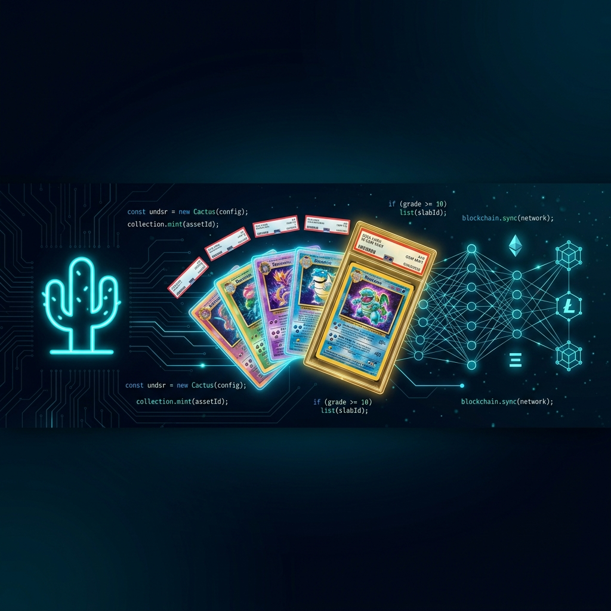

<div align="center">



# Hey, I'm SailorPepe 👋

**Founder @ THE UNDESIRABLES LLC**

Building at the intersection of AI, blockchain, and digital collectibles.

[](https://www.the-undesirables.com)
[](https://x.com/TheUndesirable5)
[](https://www.npmjs.com/package/plugin-undesirables)
[](https://pypi.org/project/undesirables-mcp-server/)

</div>

---

### 🖥️ Desktop & Mobile Apps

| App | Description | Stack |
|-----|-------------|-------|
| **[Undesirables Desktop](https://github.com/sailorpepe/undesirables-desktop)** | Full desktop app — TCG analytics, NFT generation, AI card grading, UNDSR slab renderer | Tauri v2, Rust, React |
| **[TCG Oracle App](https://github.com/sailorpepe/tcg-oracle-app)** | Cross-platform TCG market intelligence — price analytics, AI grading, Vault portfolio tracking | React Native, Expo |

---

### 🤖 AI Agent Ecosystem

A three-tier AI infrastructure: free plugin for distribution, paid API for revenue, local MCP for compute.

| Tier | Project | Distribution | Stack |
|------|---------|-------------|-------|
| **Plugin** | **[ElizaOS Plugin](https://github.com/sailorpepe/plugin-undesirables)** — 4,444 autonomous AI agents, Personality-as-Code, 24 skills, 9 actions | npm v2.5.0 | TypeScript |
| **Oracle API** | **[x402 Server](https://github.com/sailorpepe/undesirables-x402-server)** — Stochastic finance engine, Monte Carlo simulation (Merton Jump-Diffusion), AI card grading, micropayments on Base | x402 USDC | Python |
| **MCP Server** | **[MCP Server](https://github.com/sailorpepe/undesirables-mcp-server)** — 35+ local compute tools, native TTS, hardware-accelerated 3D forging, zero telemetry | PyPI v1.1.7 | Python |

| Supporting | Description |
|------------|-------------|
| **[ElizaOS TCG Plugin](https://github.com/sailorpepe/elizaos-tcg-oracle-plugin)** | Standalone ElizaOS plugin for TCG market intelligence |

---

### ⛓️ Blockchain — Smart Contracts & On-Chain

| Chain | Project | Details |
|-------|---------|---------|
| **Ethereum** | **[The Undesirables NFT](https://github.com/sailorpepe/contracts)** | 4,444 ERC-721 collection on [Scatter.art](https://www.scatter.art/collection/the-undesirables) — 273 minted |
| **LitVM LiteForge** | **[TCG Price Oracle](https://github.com/sailorpepe/litvm-tcg-oracle)** | On-chain price feeds — 50 products, 260+ updates, hourly refresh |
| **LitVM LiteForge** | **[GradingEscrow](https://liteforge.explorer.caldera.xyz/address/0xe784d2AE4171De8f909eb638a60BE03B2341bB82)** | AI grading payments (0.001 zkLTC) |
| **LitVM LiteForge** | **[TCGOracleToken](https://liteforge.explorer.caldera.xyz/address/0x8D0AF701d318Be518F9ca6934B8F76Be24029AD4)** | TCGO governance token (1M supply) |
| **Base** | x402 settlements | Agent-to-agent micropayments via USDC |

---

### 📊 By the Numbers

```
370K+    Products indexed in market database
6.2M+    Price history data points
50       Products tracked on-chain (LitVM)
4,444    NFTs generated (ERC-721)
35+      MCP compute tools
9        Paid x402 API endpoints
24       AI agent skills
```

---

### 🛠️ Tech Stack

<div align="center">


</div>

---

<div align="center">

*The AI does the work. The blockchain makes it real.*

**THE UNDESIRABLES LLC**

</div>
